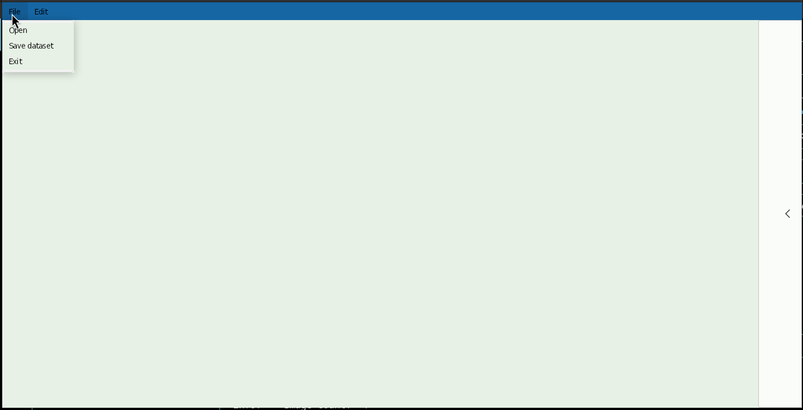
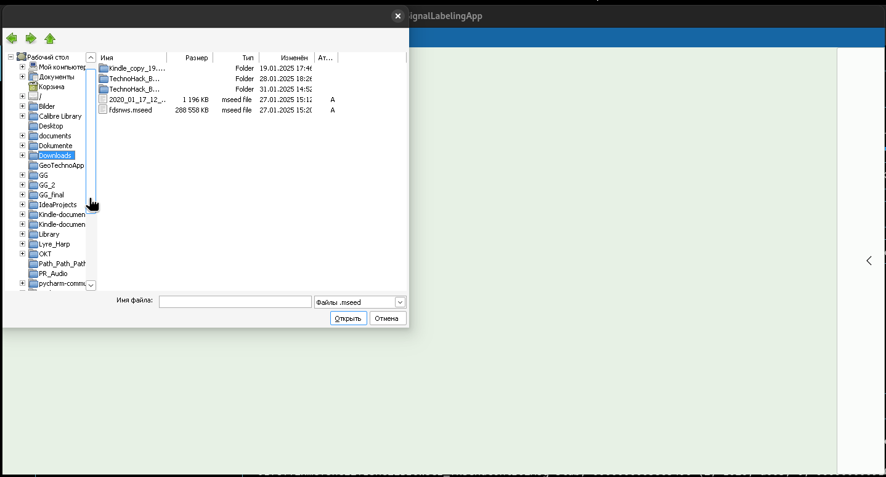
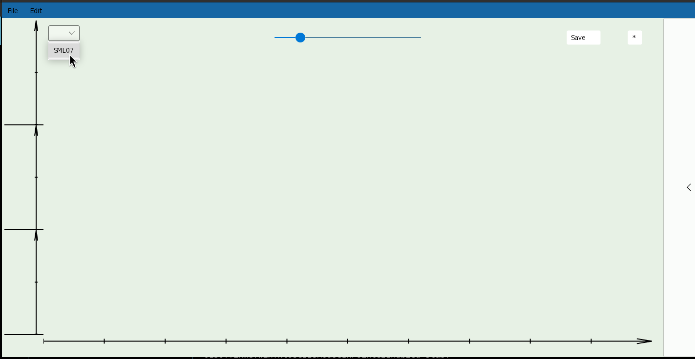
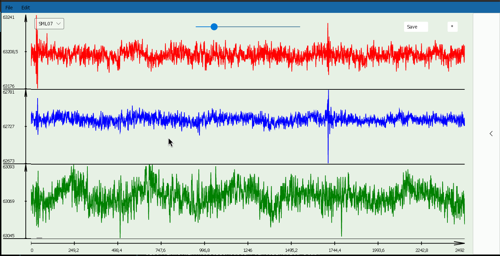
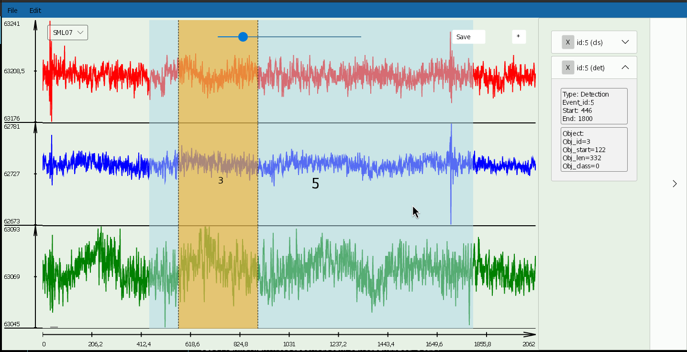
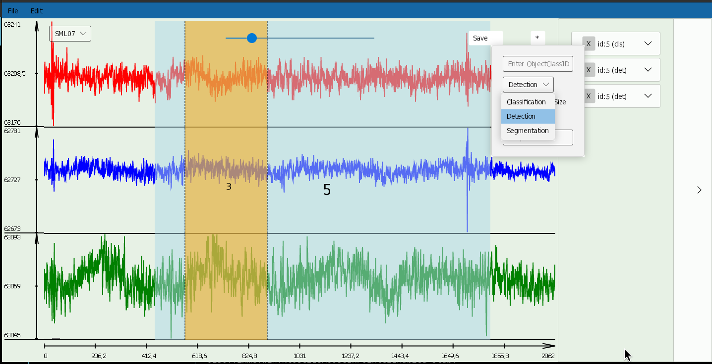

# SignalLabelingApp 🚀


Приложение для разметки сигналов с удобным интерфейсом на Avalonia.

(Кроссплатформенное приложение для разметки сигналов) 

Для создания использовался фреймворк Avalonia UI на языке C#.


---

## 📥 Установка и сборка

### Требования:
Сначала установить .NET последней версии, перезапустить компьютер, установить дополнение для C# и Avalonia UI в VS code.
- **.NET 8 SDK** (проверь версию: `dotnet --version` в PowerShell)
- **Python 3.9** (для интеграционных фич и mseed, он автоматически устанавливается при открытии mseed файла)
- **Git** (чтобы клонировать репозиторий)

### Инструкция:
1. **Клонируй репозиторий:**
   ```powershell
   git clone https://github.com/dolganin/TechoHack_Base --branch main
   cd SignalLabelingApp
   ```
2. **Восстанови зависимости .NET**
    ```powershell
    dotnet restore
    ```
3. Собери проект:
    ```powershell
    dotnet build
    ```
4. Запусти проект
    ```powershell
    dotnet run
    ```


## Читаемые форматы
Программа принимает и обрабатывает файлы в формате *mseed*, возвращая *json*-файл.
Программа поддерживает работу с файлами в формате mseed.
После работы с mseed файлом результаты можно сохранить в json файлы в выбранную папку. 


## Интерфейс
После запуска приложения откроется окно, в котором по кнопке ***File*** -> ***Open***  можно выбрать требуемый *mseed*-файл.  











---

### Разметка
После открытия mseed файла и выбора станции, в редакторе отрисовываются компоненты сигнала.
(На открывшихся трех графиках видны составляющие сигнала.) Для разметки, выбери левой кнопкой мыши голубую область, которая будет подана нейросети для анализа, в границах которой выбирается оранжевая область, которая нам наиболее интересна.

При нажатии ЛКМ в области редактора создаётся выделение той области сигнала, которая будет вырезана из всей трассы. 
При нажатии ПКМ в области редактора задаются границы той области, которая помечается как искомый сигнал/объект.



В зависимости от цели, можешь выбрать задачу из предложенных вариантов: классификация, детекция и сегментация.

На текущий момент реализована корректная работа с разметкой для классификации и детекции, сегментация в процессе разработки.




## Пример размеченного json-файла

**json-файл**
```json
{
    "label": {
        "$type": "detection",
        "objects": {
            "132": {
                "x": 419,
                "w": 3679,
                "class": 2
            },
            "133": {
                "x": 7999,
                "w": 1799,
                "class": 2
            },
            "134": {
                "x": 12739,
                "w": 1059,
                "class": 2
            }
        }
    }
}
```
